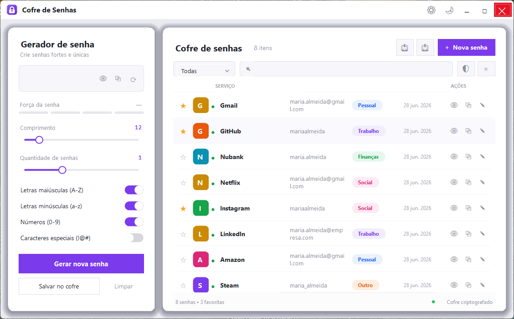
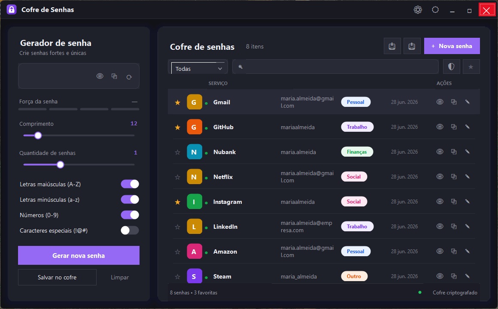

# Cofre de Senhas

Gerenciador de senhas para Windows e Linux, com gerador de senhas integrado e
cofre local criptografado. A aplicação reúne, em uma única interface, a criação
de senhas fortes e o armazenamento seguro de credenciais, protegidos por uma
senha mestra e por criptografia AES-256-GCM. Foi desenvolvido em C# com .NET 10:
a versão Windows usa Windows Forms e a versão Linux usa Avalonia, ambas sobre a
mesma biblioteca de domínio.

[](https://github.com/dcCarreto/CofreDeSenhas/actions/workflows/ci.yml)


Este é um projeto de código aberto e software livre, distribuído sob a licença
MIT. Você pode usá-lo, estudá-lo, modificá-lo e compartilhá-lo livremente.

## Sumário

- [Sobre o projeto e o software livre](#sobre-o-projeto-e-o-software-livre)
- [Visão geral](#visão-geral)
- [Capturas de tela](#capturas-de-tela)
- [Funcionalidades](#funcionalidades)
- [Modelo de segurança](#modelo-de-segurança)
- [Download e instalação](#download-e-instalação)
- [Versão para Linux](#versão-para-linux)
- [Estrutura do projeto](#estrutura-do-projeto)
- [Arquitetura](#arquitetura)
- [Tecnologias](#tecnologias)
- [Requisitos](#requisitos)
- [Compilação e execução](#compilação-e-execução)
- [Testes](#testes)
- [Geração do executável](#geração-do-executável)
- [Armazenamento de dados](#armazenamento-de-dados)
- [Roadmap](#roadmap)
- [Como contribuir](#como-contribuir)
- [Licença](#licença)

## Sobre o projeto e o software livre

Sempre acreditei que boas ferramentas deveriam estar ao alcance de qualquer
pessoa. Aprendi a programar apoiado em software livre, lendo o código de quem
veio antes de mim, e desde cedo fiz questão de respeitar as licenças, dar o
devido crédito e devolver à comunidade aquilo que ela me proporcionou. Para mim,
respeitar o que é aberto nunca foi uma formalidade: foi a forma mais honesta de
construir.

O Cofre de Senhas nasce dessa mesma convicção. Segurança e privacidade não
deveriam ser privilégio de quem pode pagar por elas, e por isso decidi que este
projeto seria aberto, gratuito e livre para usar, examinar, modificar e
distribuir. Acredito que acessibilidade e segurança caminham juntas: um programa
que protege as senhas das pessoas precisa ser inspecionável por elas. Um código
que qualquer um pode auditar é, no fim, um código em que se pode confiar.

Se este projeto for útil para você, use-o sem receios. Se quiser melhorá-lo,
seja bem-vindo. Ele foi feito para servir a todos.

## Visão geral

O programa funciona inteiramente de forma local: nenhum dado é enviado a
servidores externos, com a única exceção da verificação opcional de vazamento de
senhas, que utiliza um protocolo de anonimato descrito na seção de segurança. As
credenciais ficam em um arquivo criptografado dentro do perfil do usuário, e a
chave de criptografia é derivada da senha mestra em tempo de execução, nunca
sendo gravada em disco.

A interface é dividida em dois painéis: à esquerda, o gerador de senhas; à
direita, o cofre, com a lista de credenciais, busca, filtros e ações por item.

## Capturas de tela

O gerador de senhas fica à esquerda e o cofre à direita. A aplicação oferece
tema claro e tema escuro, com a preferência persistida entre sessões. As imagens
abaixo usam dados fictícios apenas para demonstração.

Tema claro:



Tema escuro:



## Funcionalidades

### Gerador de senhas

- Comprimento ajustável de 4 a 64 caracteres.
- Seleção dos tipos de caractere: maiúsculas, minúsculas, números e símbolos.
- Indicador visual de força em tempo real.
- Geração de várias senhas de uma só vez, com a quantidade configurável.
- Geração baseada em um gerador de números aleatórios criptográfico
  (`RandomNumberGenerator`), e não em um gerador pseudoaleatório comum.

### Cofre de senhas

- Cadastro, edição e remoção de credenciais, com os campos de serviço, usuário,
  senha, URL, categoria, notas e marcação de favorito.
- Categorias predefinidas (Trabalho, Pessoal, Finanças, Social e Outro).
- Busca em tempo real e filtro por categoria.
- Indicador de força por senha armazenada.
- Verificação de senhas comprometidas via Have I Been Pwned.
- Lista com avatar, categoria e ações rápidas para revelar, copiar e editar.

### Segurança e autenticação

- Senha mestra exigida na criação do cofre e em cada abertura.
- Limite de tentativas de desbloqueio, com bloqueio temporário após falhas
  sucessivas.
- Alteração da senha mestra pelo menu de configurações, com re-criptografia
  automática de todo o cofre e backup com rollback em caso de falha.

### Backup e recuperação

- Exportação e importação do cofre em um arquivo portável (`.gsenhas`), protegido
  por uma senha de exportação independente da senha mestra.
- Geração opcional de um QR code de backup da senha mestra, oferecido na criação
  do cofre e a cada alteração da senha mestra.

### Interface

- Janela sem moldura, com cantos arredondados e redimensionamento livre.
- Tema claro e tema escuro, com a preferência persistida entre sessões.
- Ícone próprio no executável, na janela e na bandeja do sistema, com opção de
  minimizar para a bandeja.

## Modelo de segurança

| Item | Detalhe |
|------|---------|
| Criptografia do cofre | AES-256-GCM, garantindo confidencialidade e integridade/autenticidade |
| Derivação de chave | PBKDF2-SHA256 com 100.000 iterações e salt aleatório de 128 bits |
| Senha mestra | Nunca é armazenada. O arquivo de autenticação guarda apenas o salt e um verificador (hash SHA-256 da chave derivada) |
| Exportação | AES-256-GCM com chave derivada por PBKDF2-SHA256 (200.000 iterações) a partir de uma senha de exportação separada |
| Comparações sensíveis | Realizadas em tempo constante, evitando ataques de temporização |
| Verificação de vazamento | Have I Been Pwned por k-anonymity: apenas os 5 primeiros caracteres do hash SHA-1 da senha deixam a máquina |
| Local dos dados | Pasta do usuário em `%APPDATA%\GerenciadorSenhas\`, fora do repositório |

Observações importantes:

- A chave de criptografia é derivada da senha mestra a cada execução. Se a senha
  mestra for perdida, o cofre não pode ser recuperado, pois a chave não é
  armazenada em lugar nenhum.
- Ao alterar a senha mestra, uma nova chave é derivada e todas as entradas são
  re-criptografadas. A operação faz backup dos arquivos e os restaura caso algo
  falhe, evitando deixar o cofre inacessível.
- O QR code de backup contém a senha mestra de forma legível ao ser escaneado.
  Trata-se de uma codificação, não de criptografia. Por isso ele é opcional e
  acompanhado de aviso: deve ser guardado em local seguro e off-line.

## Download e instalação

A forma mais simples de usar o programa é baixar o executável pronto na página de
[releases](../../releases):

1. Acesse a [última versão](../../releases/latest).
2. Baixe o arquivo `CofreDeSenhas.exe`.
3. Execute. Não é necessário instalar o .NET nem qualquer dependência: o
   executável é autocontido.

No primeiro uso, o programa pedirá a criação de uma senha mestra. Guarde-a com
cuidado: ela é a única forma de abrir o cofre.

## Versão para Linux

O projeto `App.Linux` é a versão do aplicativo dedicada a distribuições Linux
(X11 e Wayland), com a mesma interface, o mesmo tema claro/escuro e as mesmas
funcionalidades da versão Windows. A interface é renderizada com Avalonia e o
executável publicado é autocontido: não é preciso ter o .NET instalado.

Para compilar, publicar e instalar para o usuário atual (sem sudo), basta rodar
o script de instalação em uma máquina Linux com o .NET 10 SDK:

```
./App.Linux/distribuicao/instalar.sh
```

O script publica o binário em `~/.local/opt/cofre-de-senhas`, registra o atalho
"Cofre de Senhas" no menu de aplicativos e instala o ícone. Para remover,
execute `./App.Linux/distribuicao/desinstalar.sh` (o cofre em
`~/.config/GerenciadorSenhas` é preservado).

Também é possível publicar manualmente:

```
dotnet publish App.Linux/App.Linux.csproj -c Release -r linux-x64 --self-contained -o publish-linux
```

Os dados ficam em `~/.config/GerenciadorSenhas/`, com os mesmos arquivos e o
mesmo formato da versão Windows — um cofre exportado (`.gsenhas`) em uma
plataforma pode ser importado na outra.

## Estrutura do projeto

```
CofreDeSenhas.sln
├─ App/                          Interface Windows (Windows Forms)
│  ├─ Formularios/               Telas e diálogos da aplicação
│  ├─ Controles/                 Controles customizados de UI
│  └─ Infraestrutura/            Tema, preferências, recursos e utilitários
├─ App.Linux/                    Interface Linux (Avalonia)
│  ├─ Janelas/                   Telas e diálogos da aplicação
│  ├─ Controles/                 Controles customizados de UI
│  ├─ Infraestrutura/            Tema, preferências, recursos e utilitários
│  ├─ Ativos/                    Ícone do aplicativo
│  └─ distribuicao/              Atalho .desktop e scripts de instalação
├─ GerenciadorDeSenhas/          Biblioteca de domínio
│  ├─ Modelos/                   Entidades (Senha, Categoria, SenhaExportada)
│  ├─ Repositorios/              Acesso e gerência das credenciais
│  └─ Servicos/                  Criptografia, persistência, autenticação,
│                                exportação, verificação de vazamento e regras
└─ GerenciadorDeSenhas.Testes/   Testes automatizados (xUnit)
```

A solução separa as interfaces (projetos `App` e `App.Linux`) da lógica de
domínio (projeto `GerenciadorDeSenhas`). Isso mantém as regras de negócio e a
criptografia independentes da camada gráfica, permite testá-las de forma
isolada e faz com que as duas versões compartilhem exatamente o mesmo núcleo.

## Arquitetura

A aplicação é organizada em camadas, sem dependências de banco de dados ou de
serviços externos:

- Apresentação (projeto `App`): formulários e controles do Windows Forms,
  construídos por código. Não contém regra de negócio nem operação
  criptográfica.
- Domínio e serviços (projeto `GerenciadorDeSenhas`): autenticação da senha
  mestra, criptografia, persistência, exportação e verificação de vazamento.
- Persistência local: os dados são serializados em JSON e gravados de forma
  criptografada em um arquivo no perfil do usuário. Não há banco de dados.

Fluxo resumido da senha mestra:

1. Na criação, é gerado um salt aleatório; a chave é derivada por PBKDF2-SHA256
   (100.000 iterações) e dela se calcula um verificador SHA-256. Somente o salt e
   o verificador são gravados em `auth.dat`. A chave nunca é persistida.
2. Na abertura, a chave é derivada novamente a partir da senha informada e do
   salt; o verificador é comparado em tempo constante. Se confere, a chave passa
   a ser usada para descriptografar o cofre durante a sessão.
3. Ao alterar a senha mestra, o cofre inteiro é descriptografado com a chave
   antiga e re-criptografado com a nova, com backup e rollback automáticos.

## Tecnologias

- C# e .NET 10.
- Windows Forms na versão Windows, com interface construída por código.
- Avalonia na versão Linux, com o mesmo desenho de interface.
- Criptografia da biblioteca padrão (`System.Security.Cryptography`):
  AES-256-GCM e PBKDF2-SHA256.
- Serialização com `System.Text.Json`.
- Geração de QR code com a biblioteca QRCoder.
- Testes com xUnit.

## Requisitos

- Windows 10 ou 11, ou uma distribuição Linux com X11 ou Wayland.
- Para compilar a partir do código-fonte: .NET 10 SDK.
- Para executar o binário publicado: nada além do próprio executável, que é
  autocontido.

## Compilação e execução

A partir da raiz do repositório, no Windows:

```
dotnet run --project App/App.csproj
```

No Linux:

```
dotnet run --project App.Linux/App.Linux.csproj
```

## Testes

```
dotnet test
```

A suíte cobre testes unitários, testes de integração de ponta a ponta (criação,
persistência e recarga do cofre), testes de segurança (rejeição de dados
adulterados e de chave incorreta) e testes de desempenho com grande volume de
senhas.

## Geração do executável

Para gerar um executável único e autocontido para Windows x64:

```
dotnet publish App/App.csproj -c Release -r win-x64 --self-contained true -p:PublishSingleFile=true -p:EnableCompressionInSingleFile=true -o publish
```

O arquivo `CofreDeSenhas.exe` será criado na pasta `publish`. Para o
executável Linux, consulte a seção [Versão para Linux](#versão-para-linux).

## Armazenamento de dados

Os arquivos da aplicação ficam em `%APPDATA%\GerenciadorSenhas\` no Windows e
em `~/.config/GerenciadorSenhas/` no Linux:

- `auth.dat`: salt e verificador da senha mestra.
- `senhas.json.enc`: cofre criptografado com as credenciais.
- `config.json`: preferências da interface, como o tema.
- `backups/`: cópias de segurança do cofre.

Esses arquivos não fazem parte do repositório e contêm dados sensíveis.

## Roadmap

As funcionalidades já concluídas e as planejadas para o futuro estão descritas em
[ROADMAP.md](ROADMAP.md).

## Como contribuir

Contribuições são bem-vindas. Sinta-se à vontade para abrir uma issue relatando
um problema ou sugerindo uma melhoria, ou para enviar um pull request. Algumas
orientações simples:

- Mantenha o estilo de código existente.
- Sempre que possível, acompanhe novas funcionalidades com testes.
- Descreva com clareza o que sua mudança faz e por quê.

## Licença

Distribuído sob a licença MIT. Consulte o arquivo [LICENSE](LICENSE) para os
termos completos. Em resumo: você pode usar, copiar, modificar e distribuir este
software, inclusive em projetos comerciais, desde que mantenha o aviso de
copyright e a permissão originais.
