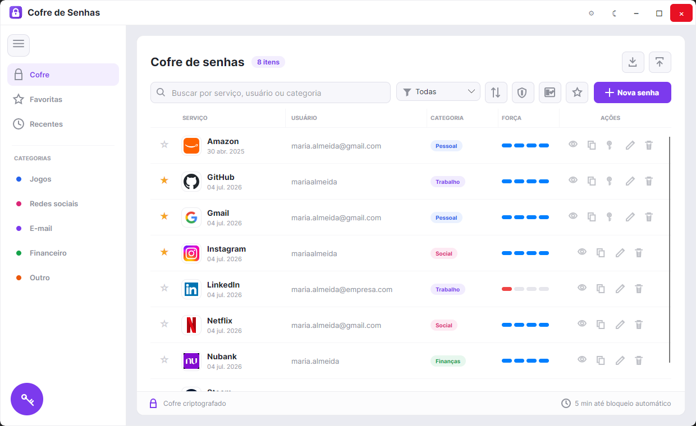
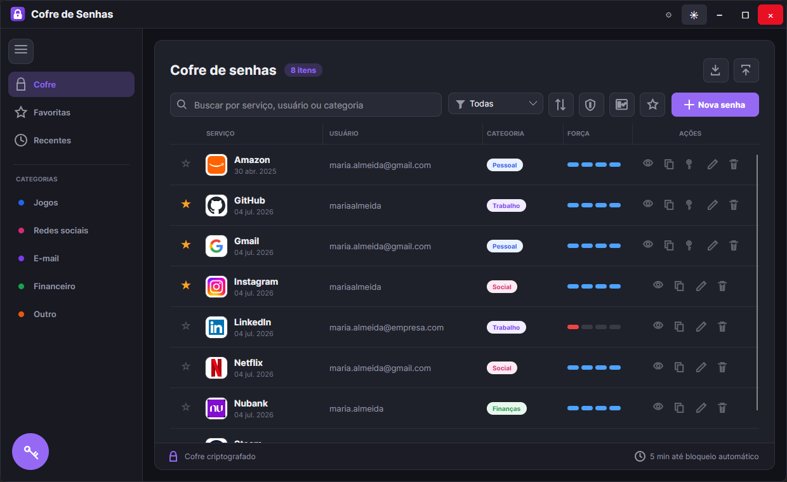
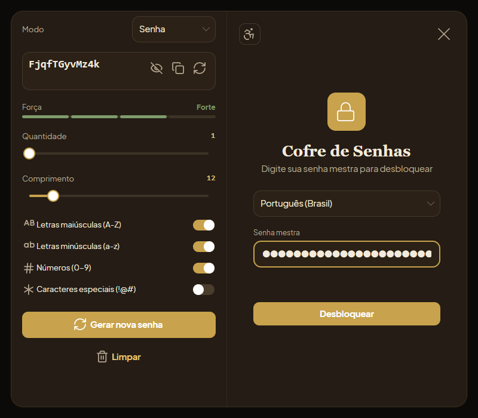
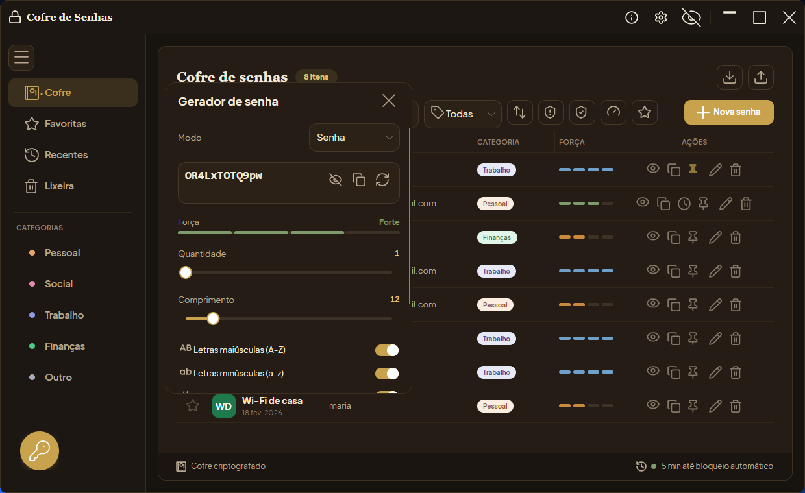
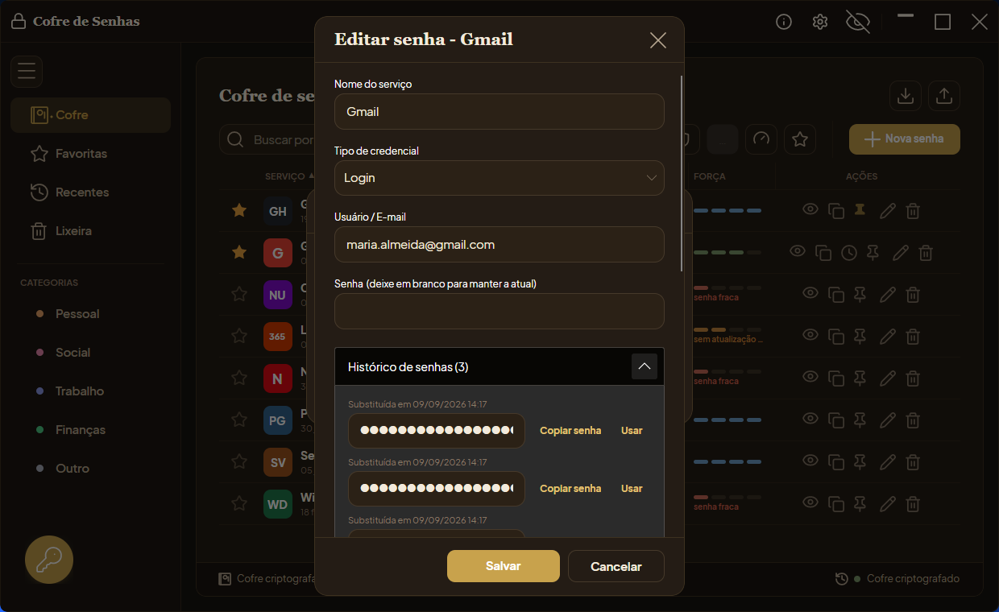
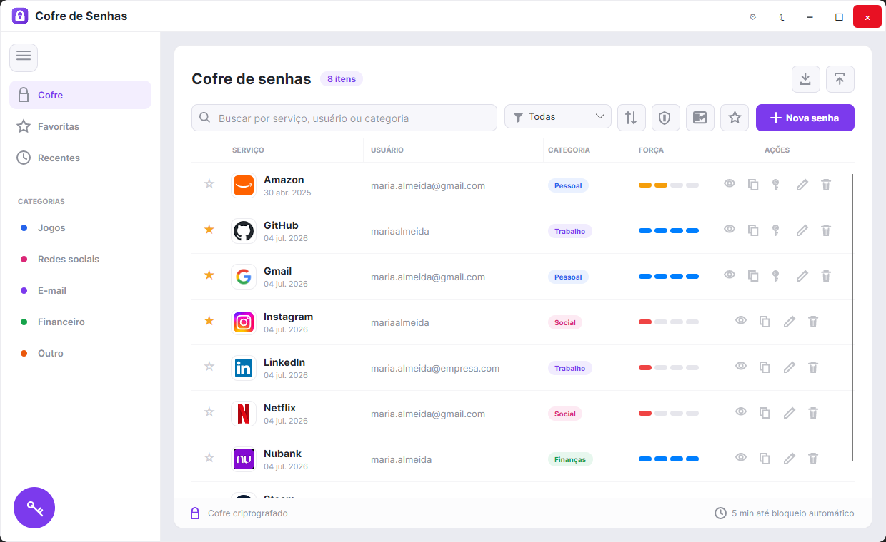
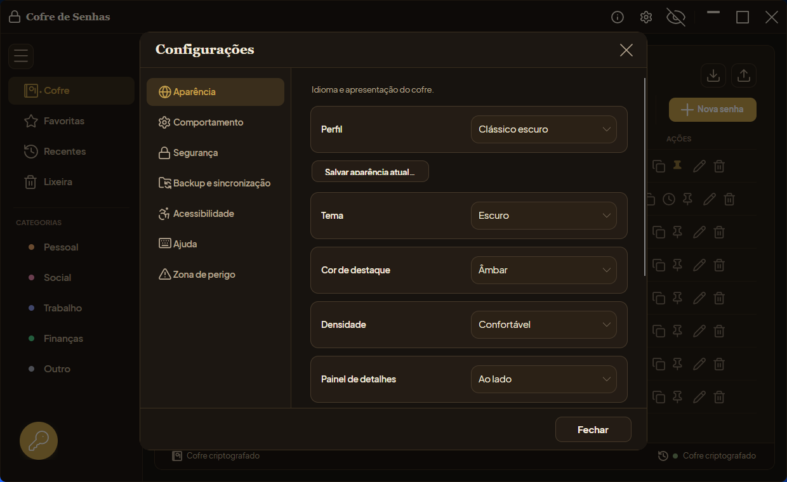

# Cofre de Senhas

Gerenciador de senhas multiplataforma (Windows e Linux), com gerador de senhas
integrado e cofre local criptografado. A aplicação reúne, em uma única
interface, a criação de senhas fortes e o armazenamento seguro de credenciais,
protegidos por uma senha mestra e por criptografia AES-256-GCM. Foi desenvolvido
em C# com .NET 10 e Avalonia, com uma única base de código para todas as
plataformas.

[](https://github.com/dcCarreto/CofreDeSenhas/actions/workflows/ci.yml)


Este é um projeto de código aberto e software livre, distribuído sob a licença
MIT. Você pode usá-lo, estudá-lo, modificá-lo e compartilhá-lo livremente.

## Sumário

- [Sobre o projeto e o software livre](#sobre-o-projeto-e-o-software-livre)
- [Visão geral](#visão-geral)
- [Capturas de tela](#capturas-de-tela)
- [Funcionalidades](#funcionalidades)
- [Modelo de segurança](#modelo-de-segurança)
- [Política de segurança e divulgação de vulnerabilidades](SECURITY.md)
- [Download e instalação](#download-e-instalação)
- [Estrutura do projeto](#estrutura-do-projeto)
- [Arquitetura](#arquitetura)
- [Tecnologias](#tecnologias)
- [Requisitos](#requisitos)
- [Compilação e execução](#compilação-e-execução)
- [Testes](#testes)
- [Geração do executável](#geração-do-executável)
- [Armazenamento de dados](#armazenamento-de-dados)
- [Roadmap](#roadmap)
- [Como contribuir](#como-contribuir)
- [Licença](#licença)

## Sobre o projeto e o software livre

Sempre acreditei que boas ferramentas deveriam estar ao alcance de qualquer
pessoa. Aprendi a programar apoiado em software livre, lendo o código de quem
veio antes de mim, e desde cedo fiz questão de respeitar as licenças, dar o
devido crédito e devolver à comunidade aquilo que ela me proporcionou. Para mim,
respeitar o que é aberto nunca foi uma formalidade: foi a forma mais honesta de
construir.

O Cofre de Senhas nasce dessa mesma convicção. Segurança e privacidade não
deveriam ser privilégio de quem pode pagar por elas, e por isso decidi que este
projeto seria aberto, gratuito e livre para usar, examinar, modificar e
distribuir. Acredito que acessibilidade e segurança caminham juntas: um programa
que protege as senhas das pessoas precisa ser inspecionável por elas. Um código
que qualquer um pode auditar é, no fim, um código em que se pode confiar.

Se este projeto for útil para você, use-o sem receios. Se quiser melhorá-lo,
seja bem-vindo. Ele foi feito para servir a todos.

Este aplicativo nasceu livre e continuará livre. Nenhuma evolução futura muda
isso: o código-fonte permanece aberto sob a licença MIT, sem versões pagas, sem
recursos escondidos atrás de assinatura e sem coleta de dados. Cada nova etapa
do projeto é construída respeitando esse compromisso.

## Visão geral

O programa funciona, por padrão, inteiramente de forma local: nenhum dado é
enviado a servidores externos, salvo a verificação opcional de vazamento de
senhas, que utiliza um protocolo de anonimato descrito na seção de segurança. As
credenciais ficam em um arquivo criptografado dentro do perfil do usuário, e a
chave de criptografia é derivada da senha mestra em tempo de execução, nunca
sendo gravada em disco. Opcionalmente, é possível conectar o cofre a um banco de
dados de sua escolha (SQLite, PostgreSQL, MySQL/MariaDB ou SQL Server); nesse
caso, o cofre local e o banco são sincronizados e mantidos espelhados, sempre
com a senha armazenada de forma cifrada.

A janela principal tem uma barra lateral de navegação (cofre, favoritas,
recentes e categorias) e, ao centro, a lista de credenciais com busca, filtro
por categoria, auditoria e ações por item. O gerador de senhas abre em um painel
sob demanda e também aparece lado a lado com o desbloqueio na tela de senha
mestra, permitindo criar e copiar senhas antes mesmo de abrir o cofre.

## Capturas de tela

A tela principal reúne a barra lateral de navegação, a lista de credenciais e o
status do cofre no rodapé. A aplicação oferece tema claro e tema escuro, com a
preferência persistida entre sessões. As imagens abaixo usam dados fictícios
apenas para demonstração.

Tema claro:



Tema escuro:



Na tela de senha mestra, o gerador fica à esquerda e o desbloqueio à direita, com
seletor de idioma e, no Windows, a opção de desbloqueio por Windows Hello:



## Funcionalidades

### Gerador de senhas

- Comprimento ajustável de 4 a 64 caracteres.
- Seleção dos tipos de caractere: maiúsculas, minúsculas, números e símbolos.
- Modo de frases-senha (passphrases) a partir de lista de palavras, com
  quantidade de palavras, separador, capitalização e número final configuráveis.
- Indicador visual de força em tempo real.
- Geração de várias senhas de uma só vez, com a quantidade configurável.
- Área de senha gerada flexível: senhas longas e múltiplas senhas expandem o
  campo verticalmente e empurram os demais controles para baixo, com rolagem no
  painel esquerdo quando necessário.
- Geração baseada em um gerador de números aleatórios criptográfico
  (`RandomNumberGenerator`), e não em um gerador pseudoaleatório comum.
- Disponível também na tela de senha mestra, antes do desbloqueio: dá para gerar
  e copiar senhas sem abrir o cofre, com a opção de salvar surgindo somente após
  a autenticação.

O painel do gerador, com a senha gerada, o indicador de força e as opções de
caractere:



### Cofre de senhas

- Cadastro, edição e remoção de credenciais, com os campos de serviço, usuário,
  senha, URL, categoria, notas e marcação de favorito.
- Códigos TOTP (autenticação em duas etapas) por entrada: cole a chave secreta
  (Base32) ou um link `otpauth://` e o cofre gera o código de seis dígitos
  localmente, com prévia ao vivo e contagem regressiva na criação e edição, além
  de cópia por um clique na lista.
- Categorias predefinidas (Trabalho, Pessoal, Finanças, Social e Outro), com
  categoria personalizada quando `Outro` é selecionada.
- Busca em tempo real por serviço, usuário ou categoria personalizada, com filtro
  por categoria no mesmo seletor.
- Barra lateral de navegação com atalhos para o cofre completo, os favoritos, os
  itens recentes e cada categoria.
- Indicador de força por senha armazenada.
- Verificação de senhas comprometidas via Have I Been Pwned.
- Auditoria local para detectar senhas fracas, repetidas ou sem atualização há
  365 dias ou mais.
- Histórico de senhas por credencial: a cada troca, a senha anterior é guardada
  de forma cifrada com a data da substituição, podendo ser revelada, copiada ou
  reutilizada na tela de edição. As últimas dez versões são mantidas.
- Lista com ícones por serviço, categoria e ações rápidas para revelar, copiar e
  editar.
- Colunas redimensionáveis para serviço, usuário, categoria, data e ações.
- Edição inline do nome do serviço diretamente na lista.
- Cópia do usuário com um clique na coluna `Usuário`, exibindo confirmação
  visual temporária na linha.

A edição de uma credencial reúne serviço, usuário, senha, URL, categoria e notas,
com o código TOTP calculado ao vivo e o histórico das senhas anteriores:



A auditoria marca na própria lista as senhas fracas, repetidas ou sem atualização
há muito tempo, tudo localmente e sem enviar nada para fora:



### Segurança e autenticação

- Senha mestra exigida na criação do cofre e em cada abertura.
- Limite de tentativas de desbloqueio, com bloqueio temporário após falhas
  sucessivas.
- Bloqueio automático após período de inatividade, configurável no menu de
  configurações (desativado, 1, 5, 15 ou 30 minutos), voltando à tela de senha
  mestra.
- Desbloqueio por Windows Hello/biometria no Windows, com ativação por
  dispositivo e senha mestra como fallback.
- Alteração da senha mestra pelo menu de configurações, com re-criptografia
  automática de todo o cofre e backup com rollback em caso de falha.

### Backup e recuperação

- Exportação e importação do cofre em um arquivo portável (`.gsenhas`), protegido
  por uma senha de exportação independente da senha mestra.
- Importação de arquivos CSV de outros gerenciadores (Bitwarden, LastPass,
  1Password, Chrome/Edge, Firefox, KeePass, Dashlane, NordPass e formatos
  genéricos), com detecção automática de delimitador e mapeamento das colunas
  pelo cabeçalho, preservando segredos TOTP e favoritos.
- Geração opcional de um QR code de backup da senha mestra, oferecido na criação
  do cofre e a cada alteração da senha mestra. O QR code mostra uma versão em
  senha-frase da senha mestra, e não a senha original caractere a caractere.

### Banco de dados (opcional)

- Conexão a um banco de dados externo pelo menu de configurações, com suporte a
  SQLite, PostgreSQL, MySQL/MariaDB e SQL Server, e teste de conexão.
- Sincronização automática ao conectar: as duas bases são mescladas e, em
  conflito de serviço + usuário, a senha do cofre local prevalece.
- A partir daí os dois ficam espelhados: cada criação, edição ou exclusão é
  gravada tanto no cofre local quanto no banco.
- Detecção da tabela `CofreDeSenhas`, com a opção de criá-la caso não exista, e
  migração leve que adiciona colunas novas a tabelas já existentes.
- A senha é sempre gravada de forma cifrada, nunca em texto puro.
- O último perfil de conexão é lembrado para agilizar reconexões; a senha do
  servidor de banco nunca é gravada em disco.

### Interface

- Janela sem moldura, com cantos arredondados e redimensionamento livre.
- Identidade visual própria, com paleta e tokens de cor, tipografia Plus Jakarta
  Sans, catálogo de ícones de traço e componentes consistentes nos dois temas.
- Tema claro e tema escuro, com a preferência persistida entre sessões.
- Recursos de acessibilidade: modos para daltonismo (protanopia, deuteranopia,
  tritanopia e monocromacia), alto contraste, escala de fonte, redução de
  animações e suporte aprimorado a leitores de tela.
- Interface internacionalizada, com seleção persistida entre português do
  Brasil, inglês, espanhol, francês, alemão e italiano.
- Layout do cofre com distribuição ajustada para priorizar a leitura do usuário,
  ícones de ação mais legíveis e distintivos de categoria compactos.
- Banco visual de ícones por serviço, com fallback local por iniciais como
  padrão. A busca de favicons reais na internet é opcional e desligada por
  padrão: ao ativá-la no menu de configurações, o aplicativo pede consentimento
  e envia apenas o domínio de cada serviço (nunca senhas, usuários ou outros
  dados). Os ícones baixados ficam em cache no disco e o cache é apagado ao
  desativar o recurso.
- Ícone próprio no executável, na janela e na bandeja do sistema (onde o
  ambiente gráfico oferece suporte).
- Mesma interface e comportamento no Windows e no Linux.

O menu de configurações reúne a alteração da senha mestra, o bloqueio automático,
o idioma, a acessibilidade, a importação de CSV, a conexão a banco de dados e o
Windows Hello:



## Modelo de segurança

| Item | Detalhe |
|------|---------|
| Criptografia do cofre | AES-256-GCM, garantindo confidencialidade e integridade/autenticidade |
| Derivação de chave | Argon2id (64 MiB de memória, 3 iterações, paralelismo 1), o padrão atual recomendado por resistir melhor a ataques por GPU/ASIC, com salt aleatório de 128 bits. Cofres ainda em PBKDF2-SHA256 (de versões anteriores) são migrados de forma transparente no próximo desbloqueio por senha mestra, com backup e rollback seguro |
| Senha mestra | Nunca é armazenada. O arquivo de autenticação guarda apenas o salt e um verificador (hash SHA-256 da chave derivada) |
| Exportação | AES-256-GCM com chave derivada por PBKDF2-SHA256 (200.000 iterações) a partir de uma senha de exportação separada |
| Comparações sensíveis | Realizadas em tempo constante, evitando ataques de temporização |
| Verificação de vazamento | Have I Been Pwned por k-anonymity: apenas os 5 primeiros caracteres do hash SHA-1 da senha deixam a máquina |
| Ícones dos serviços | Fallback local por iniciais por padrão; a busca de favicons na internet é opcional, desligada por padrão e exige consentimento. Quando ativada, apenas o domínio de cada serviço é enviado ao serviço de ícones do Google (nunca senha, usuário ou nota), e os ícones ficam em cache no disco |
| Códigos TOTP | A chave 2FA é guardada cifrada (AES-256-GCM) como a senha; os códigos são calculados localmente (RFC 6238) e nada é enviado à rede |
| Histórico de senhas | Cada senha anterior é guardada cifrada (AES-256-GCM) como a senha atual e re-cifrada ao alterar a senha mestra; permanece somente no cofre e na exportação |
| Cofre em banco de dados | Quando conectado a um banco externo, a coluna de senha guarda apenas o texto cifrado (AES-256-GCM); a senha do servidor de banco não é gravada em disco |
| Windows Hello | Opcional no Windows. A chave do cofre é cifrada (AES-256-GCM) com uma chave derivada da assinatura de uma credencial do Windows Hello (chave privada no TPM); o envelope em `biometria.dat` só pode ser aberto após a autenticação biométrica |
| Higiene de memória | A chave mestra e sua cópia interna são apagadas da memória (`CryptographicOperations.ZeroMemory`) ao bloquear ou fechar o cofre; o painel de detalhes e as linhas reveladas da lista não retêm a senha em texto claro além do necessário |
| Local dos dados | Pasta do usuário (`%APPDATA%\GerenciadorSenhas\` no Windows, `~/.config/GerenciadorSenhas/` no Linux), fora do repositório |

Observações importantes:

- A chave de criptografia é derivada da senha mestra a cada execução. Se a senha
  mestra for perdida, o cofre não pode ser recuperado, pois a chave não é
  armazenada em lugar nenhum.
- Ao alterar a senha mestra, uma nova chave é derivada e todas as entradas são
  re-criptografadas. A operação faz backup dos arquivos e os restaura caso algo
  falhe, evitando deixar o cofre inacessível.
- O QR code de backup contém uma versão senha-frase da senha mestra ao ser
  escaneado. Cada letra é representada por uma palavra, números permanecem como
  números e símbolos comuns viram nomes legíveis. Trata-se de uma codificação,
  não de criptografia. Por isso ele é opcional e acompanhado de aviso: deve ser
  guardado em local seguro e off-line.

Para saber como reportar uma vulnerabilidade encontrada no cofre, veja a
[política de segurança](SECURITY.md). Para o que o desenho de segurança do cofre
cobre e o que fica deliberadamente fora dele, veja o [modelo de ameaça](THREAT_MODEL.md).

## Download e instalação

A forma mais simples de usar o programa é baixar o executável pronto na página de
[releases](../../releases). Em qualquer plataforma, o binário é autocontido: não
é necessário instalar o .NET nem qualquer dependência.

No Windows:

1. Acesse a [última versão](../../releases/latest).
2. Baixe o instalador `CofreDeSenhas-Setup-X.Y.Z.exe`.
3. Execute e siga o assistente. Não é preciso ser administrador: por padrão o
   programa é instalado só para o usuário atual, com atalho no menu iniciar
   (e, opcionalmente, na área de trabalho) e entrada em "Aplicativos e
   recursos" para desinstalar depois.
4. Se preferir não instalar nada, o executável autocontido `CofreDeSenhas.exe`
   (sem instalador) também fica disponível na página da release — é só
   baixar e executar.

Para desinstalar, use "Aplicativos e recursos" do Windows (ou o atalho
"Desinstalar Cofre de Senhas" no menu iniciar). O cofre em
`%APPDATA%\GerenciadorSenhas` é preservado por padrão; o desinstalador
pergunta explicitamente se você também quer apagar esses dados, com a opção
padrão sendo manter.

No Linux, a forma mais simples é o **AppImage**: baixe
`CofreDeSenhas-X.Y.Z-x86_64.AppImage` na [última versão](../../releases/latest),
dê permissão de execução e rode — não precisa instalar o .NET nem nada além
disso:

```
chmod +x CofreDeSenhas-X.Y.Z-x86_64.AppImage
./CofreDeSenhas-X.Y.Z-x86_64.AppImage
```

Funciona em qualquer distribuição x86_64 recente, com integração automática de
ícone e atalho de menu se você usar um integrador de AppImage (AppImageLauncher,
Gear Lever etc.); sem um, basta executar o arquivo diretamente. O AppImage
também pode ser gerado localmente com `App/distribuicao/gerar-appimage.sh`
(com o .NET 10 SDK e `appimagetool` disponíveis).

Quem preferir compilar a partir do código-fonte, ou quer o atalho no menu de
aplicativos sem depender de um integrador de AppImage, pode usar o script de
instalação, que exige o .NET 10 SDK instalado e compila, publica e registra o
aplicativo para o usuário atual (sem sudo):

```
./App/distribuicao/instalar.sh
```

O script publica o binário em `~/.local/opt/cofre-de-senhas`, registra o atalho
"Cofre de Senhas" no menu de aplicativos e instala o ícone. Para remover,
execute `./App/distribuicao/desinstalar.sh` (o cofre em
`~/.config/GerenciadorSenhas` é preservado). Tanto o AppImage quanto o script
funcionam em ambientes X11 e Wayland.

Pacotes `.deb` e Flatpak foram avaliados e ficaram de fora por enquanto: exigem
manter um repositório próprio (ou publicação no Flathub) para atualizações
automáticas, o que não compensa o esforço com um único mantenedor e o AppImage
já cobre o caso de uso de "baixar e rodar" sem depender de gerenciador de
pacotes. Fica como possibilidade futura se houver demanda (veja o
[roadmap](ROADMAP.md)).

No primeiro uso, o programa pedirá a criação de uma senha mestra. Guarde-a com
cuidado: ela é a única forma de abrir o cofre. Um cofre exportado (`.gsenhas`)
em uma plataforma pode ser importado na outra.

### Verificando a integridade dos arquivos

Toda release publicada a partir desta versão inclui um `CHECKSUMS.txt` com o
hash SHA256 de cada arquivo disponibilizado. Depois de baixar, é possível
conferir que o arquivo não foi alterado no caminho:

```
# Windows (PowerShell)
Get-FileHash .\arquivo-baixado -Algorithm SHA256

# Linux / macOS (na pasta onde os arquivos foram baixados)
sha256sum -c CHECKSUMS.txt
```

Compare o valor calculado com o que consta em `CHECKSUMS.txt`. Os arquivos
ainda não são assinados digitalmente — assinatura de código no Windows exige
um certificado pago e é um item avaliado para o futuro (veja o
[roadmap](ROADMAP.md)) — então o hash SHA256 é, por enquanto, a forma de
verificação disponível.

## Estrutura do projeto

```
CofreDeSenhas.sln
├─ App/                          Interface (Avalonia), multiplataforma
│  ├─ Janelas/                   Telas e diálogos da aplicação
│  ├─ Controles/                 Controles customizados de UI
│  ├─ Infraestrutura/            Tema, preferências, recursos e utilitários
│  ├─ Ativos/                    Ícone do aplicativo
│  └─ distribuicao/              Scripts e atalhos de instalação (Linux e Windows)
├─ GerenciadorDeSenhas/          Biblioteca de domínio
│  ├─ Modelos/                   Entidades (Senha, Categoria, SenhaExportada,
│  │                             TipoBanco, ConexaoBanco)
│  ├─ Repositorios/              Acesso às credenciais (arquivo local, banco e
│  │                             espelho que sincroniza os dois)
│  └─ Servicos/                  Criptografia, persistência, autenticação,
│                                exportação, verificação de vazamento, conexão
│                                a banco de dados e regras
└─ GerenciadorDeSenhas.Testes/   Testes automatizados (xUnit)
```

A solução separa a interface (projeto `App`) da lógica de domínio (projeto
`GerenciadorDeSenhas`). Isso mantém as regras de negócio e a criptografia
independentes da camada gráfica e permite testá-las de forma isolada.

## Arquitetura

A aplicação é organizada em camadas, sem dependências obrigatórias de banco de
dados ou de serviços externos:

- Apresentação (projeto `App`): janelas e controles em Avalonia, com o layout
  em XAML e os controles customizados desenhados por código. Não contém regra de
  negócio nem operação criptográfica.
- Domínio e serviços (projeto `GerenciadorDeSenhas`): autenticação da senha
  mestra, criptografia, persistência, exportação, auditoria e verificação de
  vazamento.
- Persistência: por padrão, os dados são serializados em JSON e gravados de
  forma criptografada em um arquivo no perfil do usuário. Opcionalmente, o cofre
  pode ser sincronizado e mantido espelhado com um banco de dados externo
  (SQLite, PostgreSQL, MySQL/MariaDB ou SQL Server), acessado por ADO.NET,
  guardando a senha sempre cifrada.

Fluxo resumido da senha mestra:

1. Na criação, é gerado um salt aleatório; a chave é derivada por Argon2id
   (64 MiB, 3 iterações, paralelismo 1) e dela se calcula um verificador
   SHA-256. Somente o salt, o verificador e os parâmetros de derivação são
   gravados em `auth.dat`. A chave nunca é persistida.
2. Na abertura, a chave é derivada novamente a partir da senha informada, do
   salt e dos parâmetros gravados; o verificador é comparado em tempo
   constante. Se confere, a chave passa a ser usada para descriptografar o
   cofre durante a sessão. Cofres ainda em PBKDF2-SHA256 (de versões
   anteriores) são migrados nesse momento: a chave é re-derivada com Argon2id
   e o cofre inteiro é re-criptografado, com backup e rollback automáticos.
3. Ao alterar a senha mestra, o cofre inteiro é descriptografado com a chave
   antiga e re-criptografado com a nova, com backup e rollback automáticos.
4. Ao bloquear ou fechar o cofre, a chave mestra e sua cópia interna são
   apagadas da memória.

## Tecnologias

- C# e .NET 10.
- Avalonia e XAML para a interface, multiplataforma (Windows e Linux).
- Criptografia da biblioteca padrão (`System.Security.Cryptography`):
  AES-256-GCM e PBKDF2-SHA256 (exportação e migração de cofres antigos), mais
  Argon2id (`Konscious.Security.Cryptography.Argon2`) para a chave do cofre.
- Serialização com `System.Text.Json`.
- Acesso a banco de dados por ADO.NET: Microsoft.Data.Sqlite, Npgsql,
  MySqlConnector e Microsoft.Data.SqlClient.
- Geração de QR code com a biblioteca QRCoder.
- Testes com xUnit.

## Requisitos

- Windows 10 ou 11, ou uma distribuição Linux com X11 ou Wayland.
- Para compilar a partir do código-fonte: .NET 10 SDK.
- Para executar o binário publicado: nada além do próprio executável, que é
  autocontido.

## Compilação e execução

A partir da raiz do repositório, em qualquer plataforma:

```
dotnet run --project App/App.csproj
```

## Testes

```
dotnet test
```

A suíte cobre testes unitários, testes de integração de ponta a ponta (criação,
persistência e recarga do cofre), testes de segurança (rejeição de dados
adulterados e de chave incorreta) e testes de desempenho com grande volume de
senhas.

## Geração do executável

Para gerar um executável único e autocontido para Windows x64:

```
dotnet publish App/App.csproj -f net10.0-windows10.0.19041.0 -c Release -r win-x64 --self-contained true -p:PublishSingleFile=true -p:EnableCompressionInSingleFile=true -o publish
```

O arquivo `CofreDeSenhas.exe` será criado na pasta `publish`.

Para Linux x64:

```
dotnet publish App/App.csproj -f net10.0 -c Release -r linux-x64 --self-contained -o publish-linux
```

### Instalador do Windows

O instalador (`CofreDeSenhas-Setup-X.Y.Z.exe`) é gerado com o
[Inno Setup](https://jrsoftware.org/isinfo.php) a partir do executável já
publicado. Com o Inno Setup instalado (`winget install JRSoftware.InnoSetup`),
rode:

```
.\App\distribuicao\gerar-instalador.ps1
```

O script publica o aplicativo (mesmo comando acima) e compila
`App/distribuicao/cofre-de-senhas.iss`, deixando o instalador em `dist/`. A
versão é lida automaticamente de `App/App.csproj` (ou pode ser informada com
`-Versao X.Y.Z`).

O instalador não exige privilégios de administrador (instala só para o
usuário atual, em `%LocalAppData%\Programs\Cofre de Senhas`, com opção de
instalar para todos os usuários), cria o atalho no menu iniciar e registra a
desinstalação em "Aplicativos e recursos". Ao desinstalar, os dados do cofre
em `%APPDATA%\GerenciadorSenhas` são preservados por padrão — apagá-los exige
confirmação explícita numa caixa de diálogo (com "Não" como opção padrão);
desinstalações silenciosas (`/VERYSILENT`) nunca apagam o cofre.

O script `App/distribuicao/instalar.sh` faz esse publish e ainda registra o
atalho e o ícone no ambiente de trabalho.

## Armazenamento de dados

Os arquivos da aplicação ficam em `%APPDATA%\GerenciadorSenhas\` no Windows e
em `~/.config/GerenciadorSenhas/` no Linux:

- `auth.dat`: salt e verificador da senha mestra.
- `senhas.json.enc`: cofre criptografado com as credenciais.
- `biometria.dat`: chave do cofre cifrada e vinculada a uma credencial do
  Windows Hello, para desbloqueio biométrico quando ativado neste dispositivo.
- `config.json`: preferências da interface (como o tema e o idioma) e o último
  perfil de conexão a banco, sem a senha do servidor.
- `backups/`: cópias de segurança do cofre.

Esses arquivos não fazem parte do repositório e contêm dados sensíveis.

## Roadmap

As funcionalidades já concluídas e as planejadas para o futuro estão descritas em
[ROADMAP.md](ROADMAP.md).

## Como contribuir

Contribuições são bem-vindas. Sinta-se à vontade para abrir uma issue relatando
um problema ou sugerindo uma melhoria, ou para enviar um pull request. Algumas
orientações simples:

- Mantenha o estilo de código existente.
- Sempre que possível, acompanhe novas funcionalidades com testes.
- Descreva com clareza o que sua mudança faz e por quê.

## Licença

Distribuído sob a licença MIT. Consulte o arquivo [LICENSE](LICENSE) para os
termos completos. Em resumo: você pode usar, copiar, modificar e distribuir este
software, inclusive em projetos comerciais, desde que mantenha o aviso de
copyright e a permissão originais.
